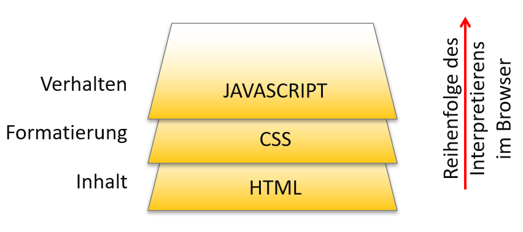

<!--
_class: lead gaia
-->
# HTML & CSS 

Martin Hutchings 


---
<!--
_class: lead gaia
-->
If you don't have one, **PLEASE** download a code editor
I will be working with `vscode`<br>


https://code.visualstudio.com/download 

---

# Day One

* Repetition
* Languages
* Static Website
* Syntax, Boilerplate
* Tags Exercise
* Source Code

---

<!-- _class: lead gaia -->
# Repetition


---

# Browser Languages

### A browser can only interpret 3 languages



---

# Mark-up Language vs. Programming Language


| Mark-up Language<br>*[Aufzeihnungssprache]* | Programming Language |
| --- | ----------- |
| Structures and Formats Content | Makes decisions after certain conditions<br>Functions under the principle of Inputs, Processing and Output|
| HTML(Content)<br>CSS(Style) | JavaScript |


---

# Static Pages

### Important:

* Stateless *[Zustandslos]* *(No Memory of past requests)*
* Is hardcoded *(All content is defined in the HTML Files)*
* Does not need any server-side language *(ex. PHP)*
* Does not connect to any Database *(Content is not Dynamic)*
* Client Side Storage Possible *(Cookies, Sessions, Local Storage etc.)*
* The starting file should be called `index.html`
* Only HTML And CSS knowledge needed

---

# Why index? 

* When sending a request to a web server `index.html` is the default file that will be loaded in the **browser**.

```
https://www.mywebsite.ch/index.html
```

---

<!-- _class: lead gaia-->
# HTML
## HTML Syntax

---

### Simple Tag

Elements are usually have **start tags** and **end tags**
```html
<h1>My Website</h1>
```
Note there is no always a start and end tag as is the case with`<br>`, `<hr>` or `` and many others.

---

### Tag with Attributes

**Attributes** *[Attributen]* add additional options to an element
```html
<h1 id="greeting-text" class="bolder">Hello World</h1>
``` 
For some elements **attributes** are optional, but sometimes they are required!

```html

```

---

### Nesting

You  can have elements inside other elements.
This is called **Nesting** *[Verschachtelung]*
```html
<section id="about">
  <header class="section_header">
    <h1>About Me</h1>
    <p>...</p>
  </header>
</section>
```
**Nesting** defines the structure of our pages

---

### HTML Hierarchy

```html
<nav>
  
  <ul>
    <li><a href="#">Home</a></li>
    <li><a href="#about">About</a></li>
    <li><a href="#contact">Contact</a></li>
    <li><a href="#blog">Blog</a></li>
  </ul>
</nav>
```

Elements can be: `parents`, `children`, `siblings` and so on ...
*[Eltern, Kinder, Geschwister]*

---

# HTML
### HTML Boilerplate *[Grundgerüst]*

```html
<!DOCTYPE html>
<html lang="en">
<head>
  <meta charset="UTF-8">
  <meta http-equiv="X-UA-Compatible" content="IE=edge">
  <meta name="viewport" content="width=device-width, initial-scale=1.0">
  <title>Document</title>
</head>
<body>
  
</body>
</html>
```
----
<!-- _class: lead gaia -->
# Lets go through it 😝 


---

### Doctype
```html
<!DOCTYPE html>
```

* All HTML documents must start with a `<!DOCTYPE>` declaration.
* The declaration is not an HTML tag. It is an *information* to the browser about what document type to expect.

--- 

### Html tag
```html
<html lang="en">
 ...
</html>
```
* Root tag of the document
* Contains the `<head>` and `<body>` tags 
* Has the `lang` [attribute](https://developer.mozilla.org/en-US/docs/Web/HTML/Global_attributes/lang) 
  * e.g: `lang="en-GB"` or `lang="de-CH"`

---

### Body
```html
<body>
  <h1>This is a heading</h1>
  <p>This is a paragraph.</p>
  ...
</body>
```

* Contains all content of the HTML Document
* Everything that is **visible**

---

### Head
```html
<head>
  <meta charset="UTF-8">
  <title>My Website</title>
  ...
</head>
```

* Contains all Metadata
* Everything that is **not visible**

---
<!-- _class: lead gaia -->
# Putting it all together 


---

# Now You! 

* Create a project using your code editor
* Name the project directory `basic_website` 
* Create an `index.html` file in the directory
* Make sure you open the project as folder in your code editor
* Give your website the **title** `basic website`
* Add a **Heading** to your Website and give it the content `My Basic Website`
* Open the website using `live server`


--- 
<!-- _class: lead gaia -->
# Semantic Mark-up

## Introducing Meaning to the web


---

# Semantic Elements

`<article>`
`<aside>`
`<figcaption>`
`<figure>`
`<footer>`
`<header>`
`<main>`
`<nav>`
`<section>`
and many more !

---

# Live Coding Example: Simple Website

---
<!-- _class: lead gaia -->
# Inspecting Code
* Recommend using Google Chrome or Firefox
* Edge and Safari are also *ok* but don't have as many features <br>


---

# Homework

* Make sure your code editor environment is working
* Have all relevant modern browsers installed in your system
* Topic Selection exercise
  * Remember to prepare examples
  * Ask Michael if unsure!