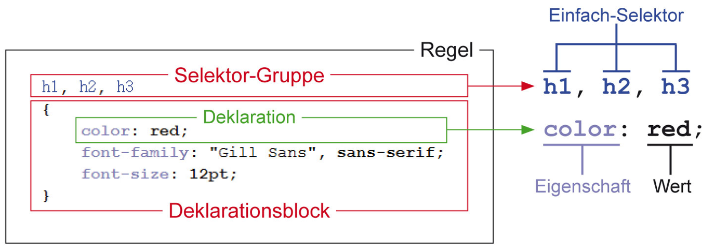
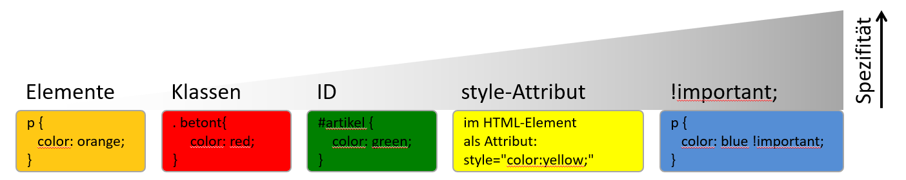

<!--
_class: lead gaia
-->
# HTML & CSS 

Martin Hutchings 


---

# Day Two

* CSS Rules 
* Linking CSS
* CSS Reset
* CSS Media Types
* CSS Selectors 
* CSS Specificity 
* Units

---

### Repetition Questions

What are the parts of an HTML Tag? 

* `<p>` Start Tag
* `</p>` End Tag
* `class="foo"` Attribute
* Content 

---

What is wrong with this example?

```html
Popcorn Time</img>
```

* `` is a self-closing tag

---

Name other self-closing tags? 

* `<meta>`
* `<br>`
* `<link>`
* `<input>` 
* more ...

--- 

How can we improve this example?

```html
<div class="container about" id="about">
  <div class="article">
    <p>...</p>
  </div>
  <div class="aside">
    <div class="side-navigation">
      <ul>
        <li><a href="#">Link 1</a></li>
        <li><a href="#">Link 2</a></li>
        <li><a href="#">Link 3</a></li>
      </ul>
    </div>
  </div>
</div>
```

* This is a perfect use case for semantic elements.

---

<!-- _class: lead gaia-->
# CSS
## Cascading Style Sheet

---

* Format templates enable modular design of websites
* Content is separated from format. IMPORTANT!!!
* Cascade means 
  * Style sheets are defined on different levels and can be overridden. 
  * The specific addressing of an element

---

* The specification plays a big role. 
  * `element` 
  * `id=` 
  * `class=` 
  * `style=""` 
  * `!important` 

---

* CSS can be created in numerous ways:
  * As a separate file (i.e. `style.css`) which is then linked to the HTML using `<link>`
  * Inside the `<head>` element using `<style></style>` 
  * As an attribute (inline-style): 
    * ```html
      <p style="color: red;">I am red.</p>
      ``` 

---

* The use of multiple stylesheets help with development
* Styles can be specified for different display sizes
  * By using `media queries` 

---
<!-- _class: lead gaia -->
# CSS Syntax


* rule, selector(group), declaration
* property, value

---

# Linking CSS

| Type | Example |
| --- | ----------- |
| As external file | `<link href="style.css" rel="stylesheet">` |
| In the `<head>` as `<style>` | `<style> p{color:red} </style>` |
| Inline as style attribute | `<p style="color:red">hello</p>` |

---
<!-- _class: lead gaia -->
# CSS Reset


---

## CSS Reset
As developers it is important to remove the browsers standard styles

* Simple CSS Reset
  * ```css
    * {
      margin: 0;
      padding: 0;
      box-sizing: border-box;
    }
    ```

* [normalize.css](https://necolas.github.io/normalize.css/)
* [Modern CSS Reset](https://raw.githubusercontent.com/elad2412/the-new-css-reset/main/css/reset.css)


---

# CSS Media Types

* Media types can be defined as HTML or as CSS
* HTML `<link rel="stylesheet" href="style.css" media="all">`
* CSS `@media all{}`
* Important Media types are: `all`, `screen`, `print`
* [List of recognized media types](https://www.w3.org/TR/CSS21/media.html%23media-types)


---
<!-- _class: lead gaia -->
# CSS Selectors


--- 

## Elements, Classes, ID's

| CSS | Description |
| --- | ----------- |
| `p {}` | All `<p>` elements |
| `p, a {}` | All `<p>` and `<a>` elements |
| `p a {}` | All `<a>` elements inside `<p>` elements [ ALL* ] |
| `.foo` | All elements with the `foo` class |
| `#foo` | All elements with the `foo` id |
| `div.foo` | All `<div>` elements with the `foo` class |
| `section div.foo` | All `<div>`s with class `foo` inside `<section>`s

--- 

## Attributes, Children, Siblings

| CSS | Description |
| --- | ----------- |
| `a[title]` | All `<a>` elements with a `title` attribute |
| `a[title="click"]` | `<a>` elements with a `title="click"` attribute |
| `p > a` | `<a>`s which are direct descendants of `<p>`s <br> *Child Selector*|
| `h1 + p` | The first `<p>`s which are adjacent to `<h1>`s <br> *Adjacent Sibling Selector*|
| `h1 ~ p` | All `<p>`s which come after `<h1>`s <br> *General Sibling Selector*|

--- 

### Pseudo Classes *[Pseudoklassen]*

| CSS | Description |
| --- | ----------- |
| `a:hover` | `<a>` elements on mouse contact |
| `a:focus` | `<a>` elements when they are focused |
| `a:visited` | `<a>` elements when they have been visited |
| `a:first-child` | The first `<a>` element |
| `a:nth-child(3)` | The third `<a>` element |
| `a:nth-child(odd/even)` | Odd/even `<a>` element |
| `a:nth-child(3n + 4)` | Each 3rd `<a>` starting after the 4th |
| `a:last-child` | The last `<a>` element |


--- 

## Pseudo Elements *[Pseudoelementen]*

| CSS | Description |
| --- | ----------- |
| `p::first-line` | The first line of all `<p>` elements |
| `p::first-letter` | The first letter of all `<p>` elements |
| `p::before` | Content before all `<p>` elements |
| `p::after` | Content after all `<p>` elements |


--- 

### **Classes** vs. ID's

* Defined by `class=` in the HTML and selected using `.` in CSS
* Can be used multiple times
```html
<style>
.red {
  color: red;
}
.crossed {
  text-decoration: line-through ;
}
</style>
<p class="red">I am red</p>
<p class="red">I am red</p>
<p class="blue">I am blue</p>
<p class="red crossed">I am red and crossed</p>
```

--- 

### Classes vs. **ID**'s

* Defined by `id=` in the HTML and selected using `#` in CSS
* Can be used once per document
```html
<style>
#main-navi {
  display: inline-block;
}

</style>
<nav id="main-navigation">
  <ul>
    ...
  </ul>
</nav>
```
---
# CSS Specificity  

* Cascading means that rules overwrite other rules.This does not only apply to the order the rules were defined in.
* Specificity *[Spezifität]* in CSS means priority.



---
<!-- _class: lead gaia -->
# Units


---

## Units *[Masseinheitent]* in CSS
### Relative units : 
* `px` Pixels (relative to the display density of the respective output medium
* `em` Relative to the font size of the parent element
* `rem` Relative to the font size of the body (16px standard)
* `%` Relative to current Size **OR** size of parent element
* `vh` Relative to the height of the viewport (1vh = 1% of viewport height)
* `vw` Relative to the width of the viewport

---
<!-- _class: lead gaia -->
# Homework 