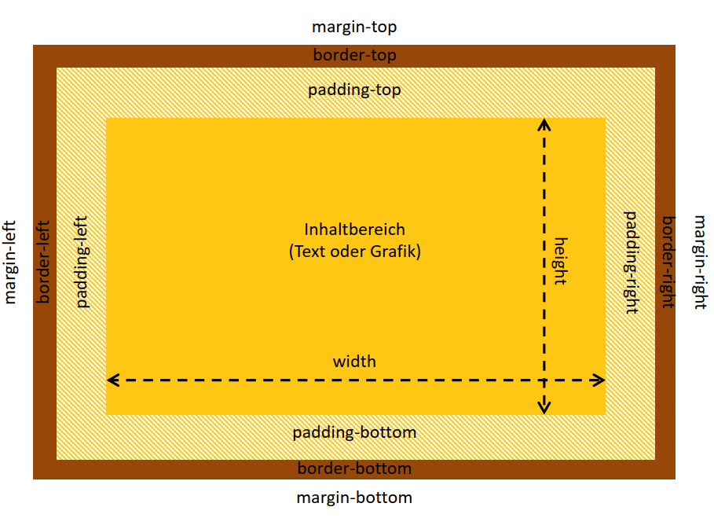
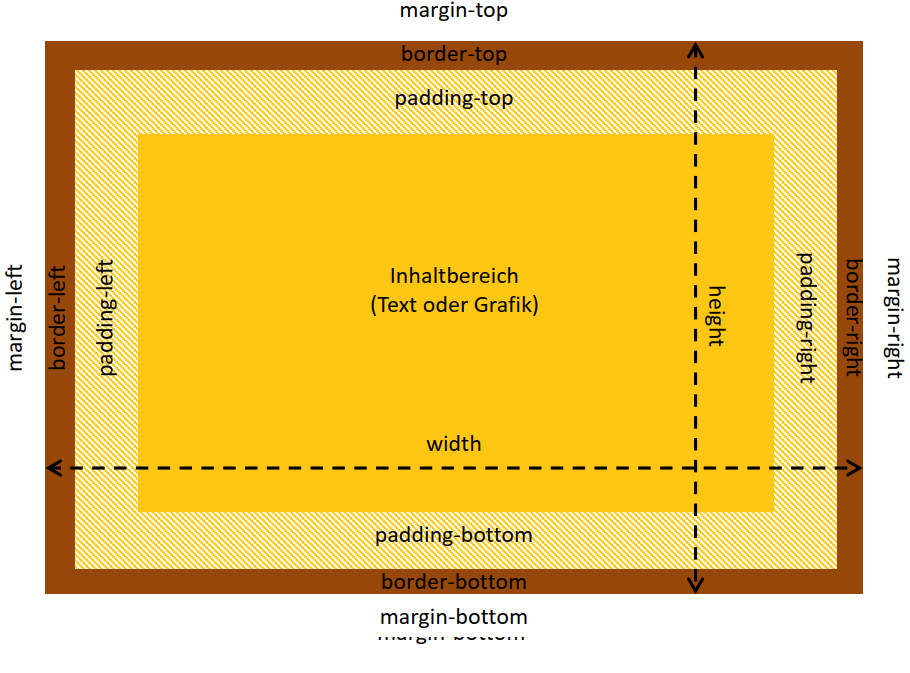
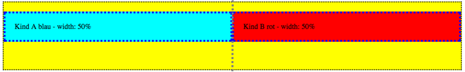
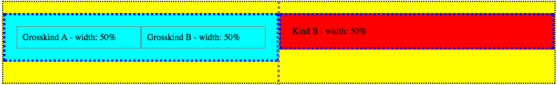
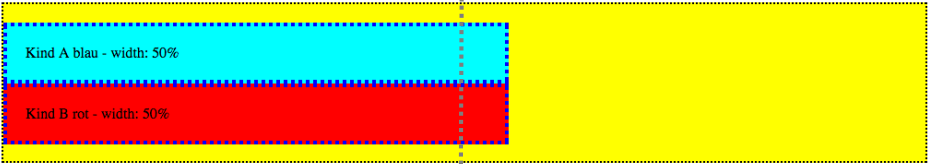
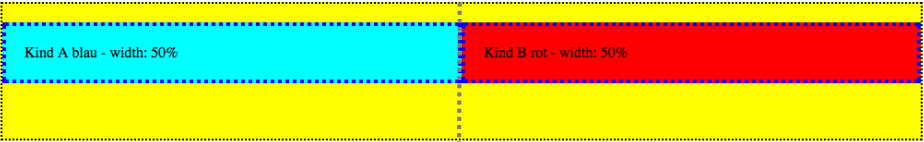

<!--
_class: lead gaia
-->
# HTML & CSS 

Martin Hutchings 


---

# Day Four

* Box Model
* Positioning
* Centering
* Example Project


---
<!-- _class: lead gaia -->
### Repetition 

Demo

---
<!-- _class: lead gaia -->
# Box Model


---
<!-- _class: lead gaia -->
### `box-sizing: content-box;`



---

## `box-sizing: content-box;`
### Properties:

* Standard
* Is not inherited *[vererbt]*

---
<!-- _class: lead gaia -->
### `box-sizing: border-box;`



---

## `box-sizing: content-box;`
### Properties:

* Standard
* Is not inherited *[vererbt]*
* We can use `%` without having to worry about borders and paddings

---

# Resetting Box Sizing

Easy Notation in CSS
```css
* {
  box-sizing: border-box;
}
```
Better, Flexible Notation
```css
*, *::before, *::after {
  box-sizing: border-box;
}
```

---

#### Guess the box-sizing

* 
* 
* 
* 

---

<!-- _class: lead gaia -->
# Positioning


---

### `position: static`

* Default value
* Normal HTML Flow
* CSS `top`, `right`, `bottom`, `left` do NOT work (only `margin`)

--- 

### `position: relative`

* Relative to the *normal* position or *start* position of the element itself.
* CSS `top`, `right`, `bottom`, `left` are activated.
* Activates a "z" axis in the form of `z-index`.


--- 

### `position: absolute`

* Relative to next **positioned** parent element.
* If **no** parent element is positioned, then relative to the `<body>`
* The element will be removed from the HTML flow
* CSS `top`, `right`, `bottom`, `left` are activated.
* Activates a "z" axis in the form of `z-index`.


--- 

### `position: fixed`

* Relative to the viewport.
  * Stays still when scrolling.
* The element will be removed from the HTML flow
* CSS `top`, `right`, `bottom`, `left` are activated.
* Activates a "z" axis in the form of `z-index`.


--- 

<!-- _class: lead gaia -->
# Let's try it out


---

<!-- _class: lead gaia -->
# Centering

---

# Methods
* Use `display: flex;` 
  * Works both **vertically** and **horizontally**
* Use `position` and `translate`
  * Works both **vertically** and **horizontally**
* Use `margin: 0 auto` 
  * Works **horizontally** 

---

### display: flex

```css
.container {
  display: flex;
  justify-content: center;
  align-items: center;
}
```
This will center the child elements in `.container`

---

### Position + Transform

```css
.item {
  position: absolute;
  left: 50%;
  top: 50%;
  transform: translate(-50%, -50%);
}
```

This will center the item relative to the next positioned parent element or the body.

--- 

### Margin auto

```css
.item {
  margin: 0 auto;
}
```

This will horizontally center the item by automatically creating margin for the left and right sides.

--- 

<!-- _class: lead gaia -->
# Let's try it out


---

<!-- _class: lead gaia -->
# Example Project

---

<!-- _class: lead gaia -->
# Homework

