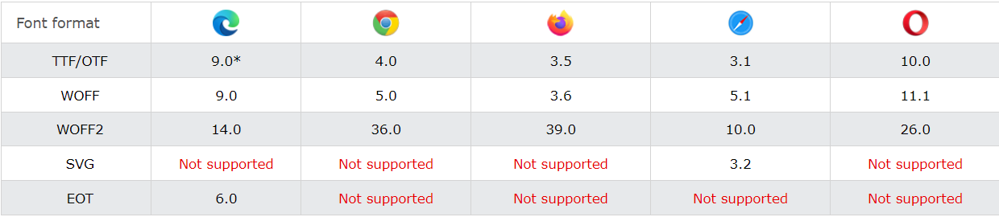
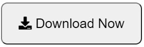

<!--
_class: lead gaia
-->
# HTML & CSS 

Martin Hutchings 


---

# Day Five

* Navigation
* Gradients
* Fonts
* Text Formatting
* Font Icons


---

<!-- _class: lead gaia -->
# Navigation


---

## The `<a>` Tag

For internal use: 
```html
<a href="blog/about-me.html">About Me</a>
```

For external use:
```html
<a href="https://sbb.ch" target="_blank">View in SBB</a>
```

* `_parent`: parent frame
* `_top`: top most frame

---

### `href`

* Sections of a page with fragment URLs
* Pieces of media files with media fragments
* Telephone numbers with `tel:` URLs
* Email addresses with `mailto:` URLs

* ```html
  <p>You can reach me at:</p>

  <ul>
    <li><a href="https://github.com/stribis/">Website</a></li>
    <li><a href="mailto:martin.hutching@sae.edu">Email</a></li>
    <li><a href="tel:+410442001201">Phone</a></li>
  </ul>

  ```

---

###### Understanding Relative Paths

|Path|	Description|
|-|-|
|`src="picture.jpg"`	|The file is located in the same folder as the current page|
|`src="images/picture.jpg"`|	The file is located in the images folder in the current folder|
|`src="/images/picture.jpg"`|	The file is located in the images folder at the root of the current project|
|`src="../picture.jpg"`|	The file is located in the folder one level up from the current folder|

---

<!-- _class: lead gaia -->
# Gradients


---
**Syntax**
* Simple: `background: linear-gradient(#e66465, #9198e5);`
* With direction: `background: linear-gradient(30deg, #e66465, #9198e5);`
* With multiple colors: `background: linear-gradient(to left, #3f87a6, #ebf8e1, #f69d3c);`
* With Stops: 
  * ```css 
      background: linear-gradient(to right, 
        red 20%, 
        orange 20% 40%, 
        yellow 40% 60%, 
        green 60% 80%, 
        blue 80%);
    ```
---

<!-- _class: lead gaia -->
# Flags Exercise


---

<!-- _class: lead gaia -->
# Fonts


---

## Online Font Service

* **FREE** [Google Fonts](https://fonts.google.com/) 
* **$$$**  [Adobe Fonts](https://fonts.adobe.com/) 
* Import the font
  * In CSS using `@import` **OR**
  * In HTML using `<link>`
* Use the font 
  * `font-family : 'font-name', fallback;`
* Use generic families as fallback options like "serif", "sans-serif", "cursive", "fantasy", "monospace"

---

## Using your own fonts

* Import file using `@font-face`
* ```css
  @font-face {
    font-family: 'Sensation Light';
    src: url(sansation_light.woff);
  }
  ```
* `src` being the relative path to the font file.
* Use the font 
  * `font-family : 'Sensation Light', fallback;`

---

## Compatibility



* As of 2021. 
* **Always** check in CANIUSE to be safe!

---

<!-- _class: lead gaia -->
# Demo Font Size

---

▪ `font-family:` Schrift1, Schrift2, sans-serif;
▪ `font-size:` px |rem | em |%
▪ `color:` farbname | hexacode | rgba
▪ `text-decoration:` none | underline | overline | line-through
▪ `text-shadow:` offset-x offset-y blur-radius color-code;
(mehrere Schatten kommaseparierte Wertketten)
▪ `text-align:` left | right | center | justify
▪ `vertical-align:` top | bottom |middle
▪ `text-transform:` uppercase | lowercase | capitalize
▪ `text-indent:`  px |rem | em |%
▪ `letter-spacing:`  px |rem | em (auch negative Werte)
▪ `line-height:` 0 bis ~ (Fliesskommazahl, px, %)
▪ `word-spacing:` px |rem | em |% (auch negative Werte)

---

# Font Icons

* [Font Awesome](https://fontawesome.com/) ***BEST**
* [Icofont](https://icofont.com/) ***As download only**
* [Fontello](https://fontello.com/) ***Create your own**
* [Iconmoon](https://icomoon.io/) ***Create your own**

---

# Aufgabe `font-icons`

Create a download button:


Create a footer:


Add a hover effect! Make the links orange when hovering.

---

<!-- _class: lead gaia -->
# Homework


