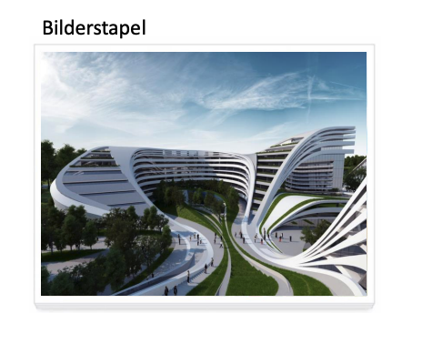

<!--
_class: lead gaia
-->
# HTML & CSS 

Martin Hutchings 


---

# Day Six

* Images
* Background
* CSS Sprites
* Favicon

---

<!--
_class: lead gaia
-->
# Image Formats


---

### Name the 4 big image formats in web
* JPG / JPEG
* PNG
* GIF
* SVG

### What are they used for? 

---

# Next-gen formats

### WebP

* Developed by Google
* Smaller file size for the same quality
* Same file size for more quality
* Initial release in 2018 (very new format)
* Supported in around 94% of all browsers
* [Caniuse](https://caniuse.com/webp)

---

# The `<picture>` tag

```html
<picture>
  <source srcset="img/awesomeWebPImage.webp" type="image/webp">
  <source srcset="img/creakyOldJPEG.jpg" type="image/jpeg"> 
  
</picture>
```

* [Check out this article for more info](https://css-tricks.com/using-webp-images/)

---
<!--
_class: lead gaia
-->
# Box Shadow Exercise

Checkout the `box-shadow` ducumentation in MDN
Try to recreate this example using any image you want



---
<!--
_class: lead gaia
-->
# Background Image


---

## Syntax

```css
.foo {
  background-image: url('images/myimage.jpg');
  background-position: center center;
  background-repeat: no-repeat;
  background-size: cover;
} 
```

|Advantages|Disadvantages|
|---|---|
|Access to `cover`|Do not have an `alt` attribute|
|Easy to work with|Separation of Concerns|
|Very flexible|Can't have multiple fallbacks like with `picture`|


---

## CSS Sprites

Demo using CSS Sprites


```css
  .foo {
    width: 191px;
    height: 150px;
    background: url('images/dw-logo-sprite.jpg');
  }
  .foo:hover {
    background-position: 191px 0;
  }
```

---

# Favicon

* We use `<link>` to link favicons
* There are lots of possible favicons. Use a generator when possible.
* I use favicon.io

---
<!--
_class: lead gaia
-->
# Homework