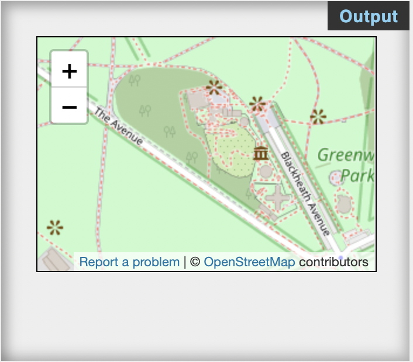

<!--
_class: lead gaia
-->
# HTML & CSS 

Martin Hutchings 


---

# Day Seven

* Tables
* iFrames
* Forms

---

<!--
_class: lead gaia
-->
# Tables


---

###### Syntax

```html

<table>
  <caption>Student Grades WDD 921</caption>
  <tr>
    <th>First Name</th>
    <th>Last Name</th>
    <th>Grade</th>
  </tr>
  <tr>
    <td>Harry</td>
    <td>Potter</td>
    <td>10</td>
  </tr>
  <tr>
    <td>Hermione</td>
    <td>Granger</td>
    <td>1</td>
  </tr>
  <tr>
    <td>Ron</td>
    <td>Weasley</td>
    <td>12</td>
  </tr>
</table>

```

---
<!--
_class: lead gaia
-->


---

# iFrames

```html
<iframe id="inlineFrameExample"
    title="Inline Frame Example"
    width="300"
    height="200"
    src="https://www.openstreetmap.org/export/embed.html?bbox=-0.004017949104309083%2C51.47612752641776%2C0.00030577182769775396%2C51.478569861898606&layer=mapnik">
</iframe>
```



---

<!--
_class: lead gaia
-->
# Forms


---

## `<form>`, `<input>` and `<label>`

* All form elements are contained in a `<form>` tag
* All `<input>` elements in a form should have a corresponding `<label>` to be accessible.
* There are multiple types of input elements that fit different purposes.


---

## `<input>` types 

* `text` : first name, last name
* `email` : email validation
* `password` : hides password field using *****
* `tel` : telephone numbers
* `url` : a link to a website
* `radio` : radio button (has to have a `name` attribute identical to the other radio button) 
* `checkbox` : checkbox, does not depend on other checkboxes
* `number` : can have a `min` and `max` attribute

---

`<input>` types 

* `<selection>` 
  * contains `<option>`s
  * not actually an `input`
* `date` : provides a date picker in modern browsers
* `color` : provides a color picker in modern browsers
* `time` : provides a time picker in modern browsers
* `<input list="foo">`
  * is bound to a `<datalist id="foo">`
  * the list can have multiple `<option>`s

---

* `<selection>` 
  * contains `<option>`s
  * not actually an `input`
* `date` : provides a date picker in modern browsers
* `color` : provides a color picker in modern browsers
* `time` : provides a time picker in modern browsers
* `<input list="foo">`
  * is bound to a `<datalist id="foo">`
  * the list can have multiple `<option>`s
* `<textarea>` : Multiple lines of text

---

Example:
```html
<form>
  <label for="first-name">First Name</label>
  <input type="text" id="first-name">
  <label for="last-name">Last Name</label>
  <input type="text" id="last-name">
  <label for="email">Email Address</label>
  <input type="email" id="email">
  <label for="message">Your Message</label>
  <textarea name="message" id="message" cols="30" rows="10"></textarea>
</form>
```

---
<!--
_class: lead gaia
-->


---
<!--
_class: lead gaia
-->

# Homework

